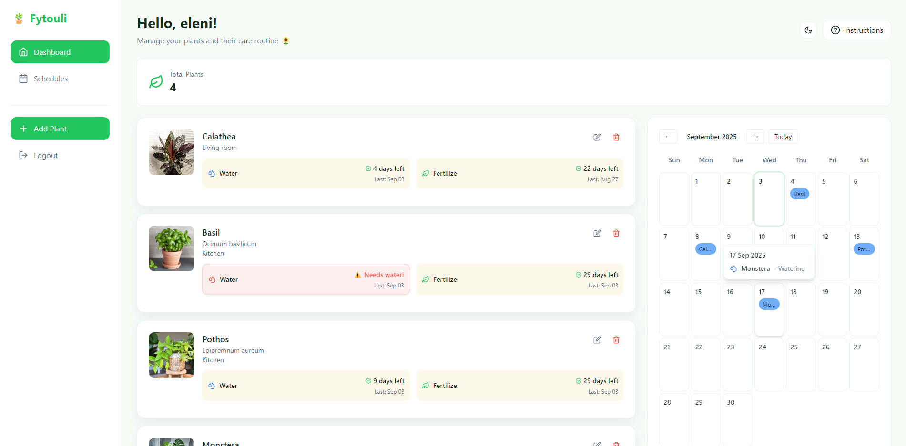
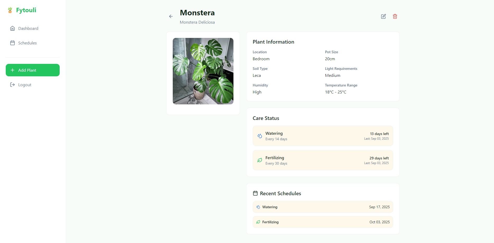
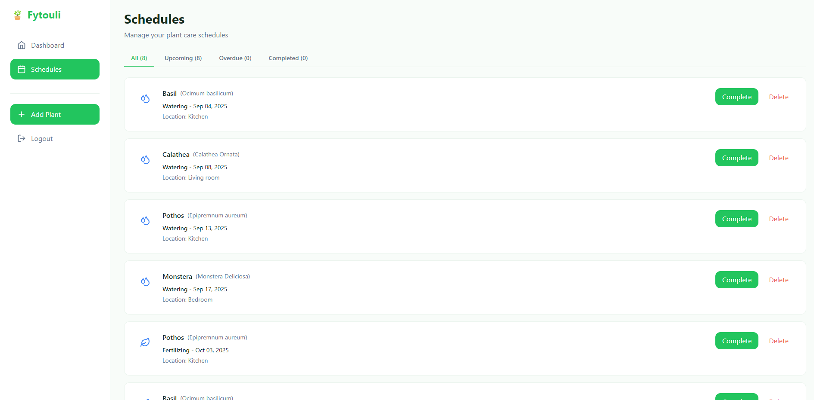
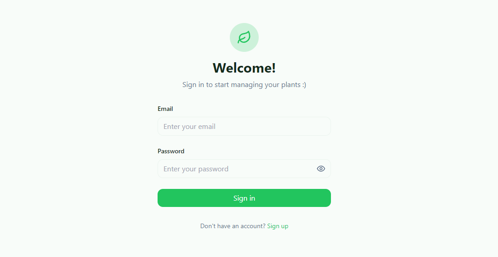

# 🌱 Fytouli — Plant Care App

A small app to manage plants, track watering/fertilizing schedules, and visualize tasks on a calendar.

This repo contains a TypeScript + React frontend and an Express + TypeScript backend with MongoDB (Mongoose).

## Key Features

- User authentication (JWT)

- Register and login

- Add, edit, and delete plants (name, species, pot, light, humidity, notes, optional image)

- Quick actions: mark a plant as watered or fertilized (updates schedules & last care dates)

- Automatic scheduling of watering/fertilizing tasks

- View schedules filtered by upcoming, overdue, and completed

- Calendar view with daily tasks

- Dashboard with plants, care status, and upcoming tasks

- Dark mode

## Screenshots










## Tech Stack

- Frontend: React 18, TypeScript, Vite, Tailwind CSS

- Backend: Node.js, Express, TypeScript, Mongoose (MongoDB)

- Auth: JWT

## Quickstart

Prerequisites: Node.js v16+, npm (or yarn), Docker (optional)

Recommended: run with Docker Compose (includes MongoDB)

1) Start with Docker:

```bash
git clone <repo-url>
cd plant_care
on vite.config.ts replace target: 'http://localhost:5000' with target: 'http://backend:5000'
docker-compose up -d

# Frontend: http://localhost:3000
# Backend:  http://localhost:5000
```

2) Or run locally (separate servers):

Windows / macOS / Linux (same commands):

```bash
# From project root
npm install


# Backend
cd backend
cp env.example .env        # or copy/edit env.example to .env on Windows
npm install
npm run dev

# In a new terminal: Frontend
cd ../frontend
npm install
npm run dev
```

Edit `backend/.env` and set `MONGODB_URI` if not using Docker. The example file contains the variables used by the backend.

## Available Scripts

From the root:
- `npm run dev` — starts both backend and frontend in dev mode (uses concurrently)
- `npm run client` — starts frontend only
- `npm run server` — starts backend only

Backend (inside `backend`):
- `npm run dev` — nodemon TypeScript dev server
- `npm run build` — compile TypeScript
- `npm start` — run compiled server

Frontend (inside `frontend`):
- `npm run dev` — Vite dev server
- `npm run build` — build production bundle
- `npm run preview` — preview build

## API (selected endpoints)

Auth
- POST `/register` — create account
- POST `/login` — authenticate and receive JWT

Plants
- GET `/api/plants` — get all plants
- GET `/api/plants/:id` — get plant by id
- POST `/api/plants` — create plant
- PUT `/api/plants/:id` — update plant
- DELETE `/api/plants/:id` — delete plant
- POST `/api/plants/:id/water` — mark watered
- POST `/api/plants/:id/fertilize` — mark fertilized

Schedules
- GET `/api/schedules` — get schedules
- GET `/api/schedules/upcoming` — upcoming tasks
- GET `/api/schedules/overdue` — overdue tasks
- GET `/api/schedules/plant/:plantId` — schedules for a plant
- PUT `/api/schedules/:id/complete` — mark as completed
- DELETE `/api/schedules/:id` — delete schedule

## License

This project is licensed under the MIT License.

